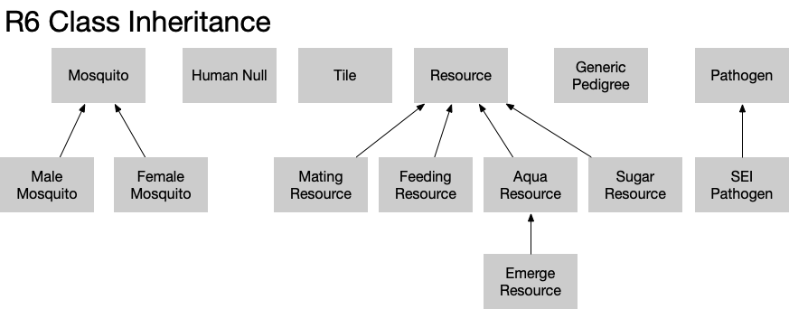

```{r setup, include=FALSE}
knitr::opts_chunk$set(echo = TRUE)
```

## Overview

There are several sources of information about this code. This code is described in a research paper, Wu, Sean L., et al. "Vector bionomics and vectorial capacity as emergent properties of mosquito behaviors and ecology." PLoS computational biology 16.4 (2020): e1007446. That paper details the model. The code, itself, has comments about what different parts represent. In this same repository, outside of the MBITES project directory, are examples of how to use the code. Here, I would like to add a description of the architecture of the code.


## MBITES Classes

This section lists every R6 class in the project. The sub-headings beneath each class describe members of the class which, themselves, may be R6 classes. In addition, we call out queues, which contain events that will happen at a future time.



* Tile is an R6 class has [TILE-Class.R]

  - Sites (R6)
  - Mosquitoes (R6)
  - Humans (R6)

  The Sites, Mosquitoes, and Humans aren't R vectors. They are a custom datatype implemented in C++ for efficiency. This type, called a HashMap, is especially quick at running an R apply over the Sites, Mosquitoes, or Humans. The function works just like a regular R apply function, except that it doesn't expect any return values, so it doesn't allocate memory for the applied function to return a value.

* Site is an R6 class with [LANDSCAPE-Site.R]

  - resources
    * feeding resources, and weights
    * aquatic resources, and weights
    * sugar resources, and weights
    * mating resources, and weights
  - x-y coordinates
  - ID of enclosing tile
  - type of the site

* Mosquito [MBITES-Mosquito.R]

  - id
  - alive
  - reference to tile
  - reference to site
  - resting spot (rspot)
  - current sugar resource
  - current mating resource
  - day emerged
  - time of next launch
  - time of current launch
  - ... lots more
  - event history

* Mosquito_Female, inherits Mosquito

  - state is blood feeding, oviposition, mating, sugar
  - list of current resources
  - egg batches
  
* Mosquito_Male, inherits Mosquito, has no members.

* Resource is an R6 class with [LANDSCAPE-Resource.R]

  - relative weight
  - reference to enclosing site
  
  * Mating resource, R6 class
  
    - QUEUE MatingQ
  
  * Aqua resource, R6 class
  
    - QUEUE EggQ
  
    - Aqua resource emerge, R6 class
    
      o QUEUE ImagoQ
  
  * Sugar resource, R6 class
  
  * Feeding resource, R6 class
  
    - QUEUE RiskQ, of zoo hosts.
  
* MBITES_Globals [MBITES-Globals.R]

  - counter of mosquito IDs
  - logging objects
  - counter of human IDs
  - counter of tile IDs

* Human [HUMAN-Null.R]

  - biting weight
  - site of feeding, site, tile
  - bitten yet
  - mosquitoes that bit me and times when bitten
  - probe-only or not

* Generic pathogen, parent of SEI Pathogen [PATHOGEN-Generic-Class.R]

  - an ID
  
* SEI_Pathogen [PATHOGEN-Generic-SIS.R]

  - infectious, true or false
  - incubating duration
  - incubation in humans
  - incubation in mosquitoes

## MBITES Structure

The code creates instances of these R6 classes, and each instance has pointers to other instances.


## MBITES Sequence

Once we know the structure, we can better understand the order in which a simulation calls functions in order to perform its job. Despite the object-oriented code, the pattern is largely structured programming, meaning top-down calls.


 1. simulation() [MBITES-Globals.R]
 
 2. simulate_MBITES_Globals [MBITES-Globals.R]
 
 3. oneDay_Tile [TILE-Simulation.R]
    
    * oneDay_ActivitySpace on humans
    
    * oneDay_AquaticEcology on Sites
    
    * Mosquitoes$apply(tag="MBITES")
    
    * Humans$apply(tag="oneDay_EventQ")
 
 * mbites_MBITES() [MBITES-Bout.R]
 
   * mbites_oneBout() [MBITES-Bout.R]
   
     - attempt_B()
       * humanEncounter() This is the place!
     - attempt_O()
     - attempt_M()
     - attempt_S()
     - restingSpot() [MBITES-Resting.R]
     - updateState() [MBITES-Bout.R]
       o energetics()
       o survival()
       o Oogenesis() [MBITES-Oogenesis.R]
       o checkEggMaturation() [MBITES-Oogenesis.R]
       o checkRefeed [MBITES-Oogenesis.R]
       o timing() [MBITES-Timing.R]
       o checkEstivation()
       o pathogenDynamics() [PATHOGEN-*.R]
     - trackHistory()
  
   * mbites_attempt_search() [MBITES-Bout.R]
   
   * mbites_move() [MBITES-Bout.R]
   
     - private$site$move_mosquito()
